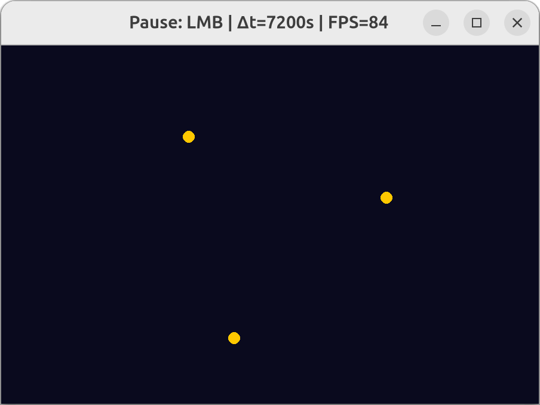

# Gravity Simulation

A minimal interactive gravity simulator that visualizes point masses orbiting each other in real time.



---

## Features

* Real‑time numerical integration (Euler, easily switchable to Velocity‑Verlet or RK4)
* Scalable units – tweak mass, distance and `SCALE` to zoom in/out
* Pause/resume with one click
* Clean, dependency‑light code (only **pygame**)

## Installation

```bash
pip install -r requirements.txt
```

## Running

```bash
python3 simulation.py
```

### Controls

| Action         | Key / Mouse             |
|----------------|-------------------------|
| Pause / resume | **Left mouse button**   |
| Full screen    | **F11**                 |
| Quit           | **Esc** or window close |

## Customizing and Opportunity for Improvements

* **Add more bodies**
  In simulation.py add more `Body(...)` instances and append to the `bodies` list.

* **Better integrator**  
  Replace the Euler block with Velocity‑Verlet for energy conservation:

  ```python
  # example skeleton
  a_old = a_total
  b.pos += b.vel * dt + 0.5 * a_old * dt**2
  a_new = compute_accel(...)
  b.vel += 0.5 * (a_old + a_new) * dt
  ```

